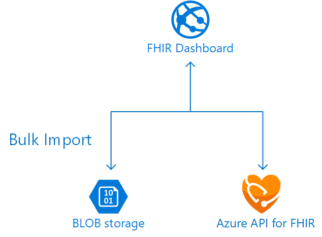
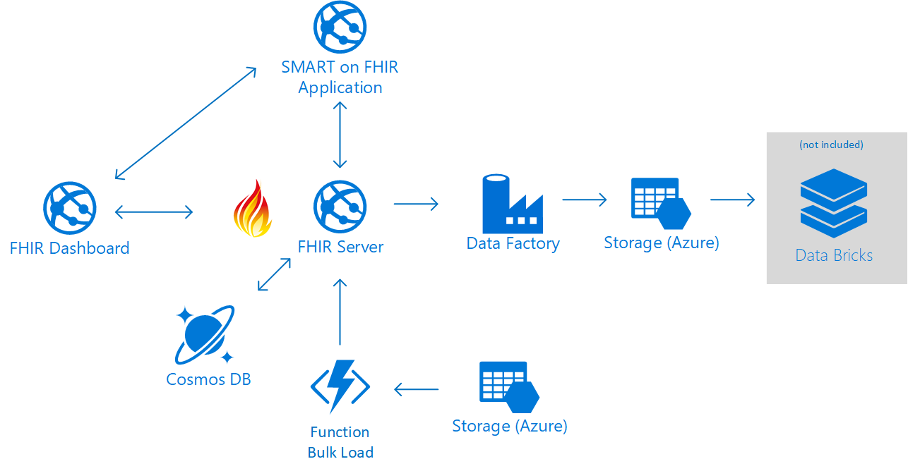

# FHIR Server Samples

This respository contains example applications and scenarios that show use of the [FHIR Server for Azure](https://github.com/Microsoft/fhir-server) and the [Azure API for FHIR](https://docs.microsoft.com/azure/healthcare-apis).

The scenario is meant to illustrate how to connect a web application to the FHIR API. The scenario also illustrates features such as the SMART on FHIR Active Directory Proxy. It can be deployed using the Azure API for FHIR PaaS server:

<center></center>

Or the open source FHIR Server for Azure:

<center></center>

In both cases a storage account will be deploy and in this storage account there is a BLOB container called `fhirimport`, patient bundles generated with [Synthea](https://github.com/synthetichealth/synthea) can dumped in this storage container and they will be ingested into the FHIR server. The bulk ingestion is performed by an Azure Function.

The environments also optionally include an [Azure Data Factory](https://azure.microsoft.com/en-us/services/data-factory/) instance, which has export pipelines configured for selected resources. The ADF export pipeline is **experimental** and not deployed by default. To deploy the ADF pipeline, add the `-DeployAdf $true` parameter to the script below.

You can decide which resources to export using the `adfExportResourceTypes` template parameter. The pipelines have to be activated manually and will produce a new line delimited json (ndjson) for each resource type. These ndjson files are easily consumed with something like [Databricks](https://azure.microsoft.com/en-us/services/databricks/) (Apache-Spark). Please see the [analytics](analytics/) folder for some details and example queries. Note that the Databricks environment is not deployed automatically with the sandbox and must be set up separately.

# Prerequisites

Before deploying the samples scenario make sure that you have `Az` and `AzureAd` powershell modules installed:

```PowerShell
Install-Module Az
Install-Module AzureAd
```

# Deployment

To deploy the sample scenario, first clone this git repo and find the deployment scripts folder:

```PowerShell
git clone https://github.com/Microsoft/fhir-server-samples
cd fhir-server-samples/deploy/scripts
```

Log into your Azure subscription:

```PowerShell
Login-AzAccount
```

Connect to Azure AD with:

```PowerShell
Connect-AzureAd -TenantDomain <AAD TenantDomain>
```

**NOTE** The connection to Azure AD can be made using a different tenant domain than the one tied to your Azure subscription. If you don't have privileges to create app registrations, users, etc. in your Azure AD tenant, you can [create a new one](https://docs.microsoft.com/azure/active-directory/develop/quickstart-create-new-tenant), which will just be used for demo identities, etc.

Then deploy the scenario with the Open Source FHIR Server for Azure:

```PowerShell
.\Create-FhirServerSamplesEnvironment.ps1 -EnvironmentName <ENVIRONMENTNAME> -UsePaaS $false
```

or the managed Azure API for FHIR:

```PowerShell
.\Create-FhirServerSamplesEnvironment.ps1 -EnvironmentName <ENVIRONMENTNAME> -UsePaaS $true
```

and to include the ADF pipeline:

```PowerShell
.\Create-FhirServerSamplesEnvironment.ps1 -EnvironmentName <ENVIRONMENTNAME> -UsePaaS $true -DeployAdf $true
```

To delete the senario:

```PowerShell
.\Delete-FhirServerSamplesEnvironment.ps1 -EnvironmentName <ENVIRONMENTNAME>
```

# Contributing

This project welcomes contributions and suggestions.  Most contributions require you to agree to a
Contributor License Agreement (CLA) declaring that you have the right to, and actually do, grant us
the rights to use your contribution. For details, visit https://cla.microsoft.com.

When you submit a pull request, a CLA-bot will automatically determine whether you need to provide
a CLA and decorate the PR appropriately (e.g., label, comment). Simply follow the instructions
provided by the bot. You will only need to do this once across all repos using our CLA.

This project has adopted the [Microsoft Open Source Code of Conduct](https://opensource.microsoft.com/codeofconduct/).
For more information see the [Code of Conduct FAQ](https://opensource.microsoft.com/codeofconduct/faq/) or
contact [opencode@microsoft.com](mailto:opencode@microsoft.com) with any additional questions or comments.
