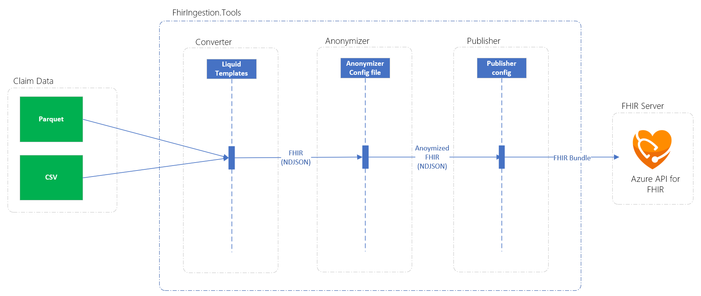
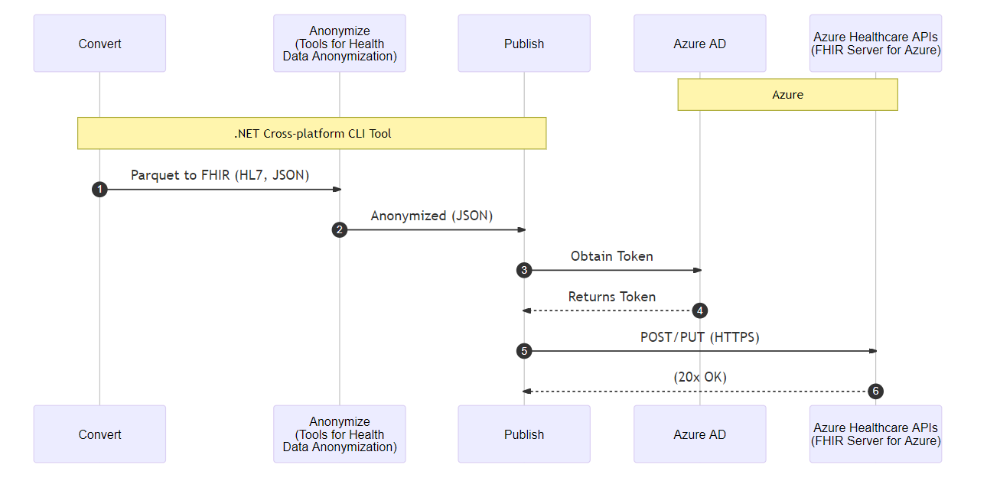

# FHIR Data Ingestion Tool

`FhirIngestion.Tools` is an open source project that enables conversion of health data from Parquet and/or CSV formats to FHIR format and pushing them to FHIR server.

Three main stages help to have a successful data ingestion:

* `Converter`
* `Anonymizer`
* `Publisher`



In this project `Convert` and `Anonymize` steps create JSON files (.ndjson bundles) in FHIR format and modify the content. `Publish` step is used to publish the FHIR format data to the FHIR server.

`FhirIngestion.Tools` Converter uses [Liquid](https://shopify.github.io/liquid/) templating language and .Net runtime for mapping data to FHIR format.

## Document Table of Content

### Getting Started to FHIR Data Ingestion Tool

* [Setup the FHIR Data Ingestion Tool](./docs/getting-started/README.md)

### Technical Specifications

* [Configuring the anonymizer file](./docs/technical/anonymizer-config-file.md)
* [Anonymization tool dependencies](./docs/technical/anonymizer-dependencies.md)
* [Adding new data format to Data Converter](./docs/technical/data-converter-adding-new-data-format.md)
* [Creating Bundle files](./docs/technical/fhir-bundle-file-generation.md)
* [FHIR file validation using Profiles](./docs/technical/fhir-file-validation.md)
* [Data conversions in Liquid templates](./docs/technical/fhir-template-data-conversions.md)

### Liquid Training

* [Getting Started with Liquid](./docs/training/getting-started-with-liquid.md)
* [Create Liquid Templates for the FHIR Data Ingestion Tool](./docs/training/create-liquid-templates-fhir-ingestion-tool.md)

### Telemetry

* [Telemetry](./docs/telemetry/telemetry.md)

## Architecture



## Stages

### 1. Converter stage

In this stage parquet and/or csv files in `Input` folder grabbed and converted to FHIR Bundle resource type using liquid templates.

Liquid templates are helping to map Parquet and/or CSV data files to the FHIR json format. Data comes from a source and is mapped directly using Liquid language in templates. FHIR is a standard for health care data exchange, published by HL7®, reference for all resource types can be found [here](http://hl7.org/fhir).

Liquid templates are located in the [templates](/config/templates) folder. The `Converted` folder under `Output` is used to store converted bundles. All the converted bundles are stored as single lines in `.ndjson` format.

Here is main bundle template `bundle.liquid`, it has embedded components where you can call other templates.

```liquid
Select the first claim

    
    
    
    
    

     FHIR Server identifier endpoint
    

     metadata for fhir templates 
    {% assign templateDate = "2021-12-01" | date: "%Y-%m-%d" -%}
    
    

     Creating Bundles with binding resource type components 
    
    {
        "resourceType": "Bundle",
        "type": "batch",
        "entry": [
            
            {{ delimiter }}
            
            {{ delimiter }}
            
            {{ delimiter }}
            
            {{ delimiter }}
            
    ]
    }
    {{ claimOutput | remove: "  " | strip_newlines }}

```

Liquid templates also include data-converters: which helps you to convert some fields in a specific way.

A sample of converting `Gender` information from one letter information to FHIR standard.

```liquid

    male
    female
    other

```

### 2. Anonymizer stage

Anonymizer stage uses `converted` `.ndjson` data from the `converter` stage as input and anonymizes the selected fields. For this stage we've used [Microsoft Tools for Health Data Anonymization](https://github.com/microsoft/Tools-for-Health-Data-Anonymization) anonymizer tool.

For anonymization configuration, [anonymizer.json](/config/anonymizer/anonymizer.json) file is used to define which fields should be anonymized.

Here is a sample of anonymizer config file defines which fields should be anonymized:

```json
{
    "fhirVersion": "R4",
    "processingErrors": "raise",
    "fhirPathRules": [
        {"path": "nodesByType('Extension')", "method": "keep"},

        {"path": "Claim.identifier", "method": "cryptoHash"},
        {"path": "Claim.status", "method": "keep"},
        {"path": "Claim.type", "method": "keep"},
        {"path": "Claim.use", "method": "keep"},
        {"path": "Claim.created", 
            "method": "generalize",
            "cases":{
                "$this": "$this.toString().replaceMatches('(?<year>[0-9]{4})-(?<month>[0-9]{2})-(?<day>[0-9]{2})', '${year}-${month}')"
            },
            "otherValues":"redact"
        },
        {"path": "Claim.priority", "method": "keep"},
        {"path": "Claim.payee.type", "method": "keep"},

        {"path": "Patient.identifier", "method": "cryptoHash"},
        {"path": "Patient.address", "method": "redact"},

        {"path": "Practitioner.identifier", "method": "cryptoHash"},
...

```

All anonymized files are located in the `anonymized` folder under the `Output` folder. All anonymized files are stored as single lines in `.ndjson` format.

### 3. Publisher stage

Publisher stage uses `.ndjson` data from the `anonymized` folder as input and read the whole file. It then publishes the data to the FHIR server with multiple threads.

Before publishing the data to the FHIR server we validate all resources using Profiles.

> Based on [Supported Azure APIs for FHIR Features](https://docs.microsoft.com/en-us/azure/healthcare-apis/fhir/fhir-features-supported), each bundle is limited to 500 items.

We're connecting FHIR Server using Azure AD authentication. In the application settings we provide server URL, tenant ID, client ID and client secret:

```json
...
  "publisher": {
      "aadClientId": "<<replace-with-aadClientId>>",
      "aadClientSecret": "<<replace-with-aadSecret>>",
      "aadResource": "https://<<replace-with-aad-resource-name>>.azurehealthcareapis.com",
      "aadTenantId": "https://login.microsoftonline.com/<<replace-with-tenant-id>>",
      "fhirServerApiUri": "https://<<replace-with-fhir-server-api-uri>>",
...
```

## Getting Started

You can run the tool either through `FhirIngestion.Tools.App.exe` for Windows, either `FhirIngestion.Tools.App` for Linux. Make sure for Linux you have the privileges to execute. If not, run a `chmod + x FhirIngestion.Tools.App` to fix this.

The following command lines option are available:

* -c, --configuration: Configuration file as a json file.
* --help: Display this help screen.
* --version: Display version information.

Please make sure to include the mandatory ones.

As an example, this is how can looks like a command line on Windows:

```shell
FhirIngestion.Tools.App.exe -c "c:\temp\config.json"
```

> **NOTE**: If no configuration file is passed, the application will try to load a default file that must be called `config.json`.

## Configuration file

The configuration file is a JSON file and looks like this:

```json
{
  "verboseLogs": true,
  "inputDir": "c:\\temp\\input",
  "outputDir": "c:\\temp\\output",
  "applicationInsightsInstrumentationKey": "<<replace-with-key>>",
  "stages": {
    "converter": {
      "templatesDir": "c:\\temp\\templates",
      "outputDir": ".\\converted"
    },
    "anonymizer": {
      "toolPath": "c:\\temp\\Microsoft.Health.Fhir.Anonymizer.R4.CommandLineTool",
      "toolConfigPath": "c:\\temp\\Microsoft.Health.Fhir.Anonymizer.R4.CommandLineTool\\configuration-sample.json",
      "outputDir": ".\\anonymized"
    },
    "publisher": {
      "aadClientId": "<<replace-with-aadClientId>>",
      "aadClientSecret": "<<replace-with-aadSecret>>",
      "aadResource": "https://<<replace-with-aad-resource-name>>.azurehealthcareapis.com",
      "aadTenantId": "https://login.microsoftonline.com/<<replace-with-tenant-id>>",
      "fhirServerApiUri": "https://<<replace-with-fhir-server-api-uri>>",
      "maxDegreeOfParallelism": 8,
      "maxRetryCount": 3,
      "metricsRefreshInterval": 3,
      "outputResponseBundlesDir": ".\\published"
    }
  }
}
```

## External References

* [FHIR is a standard - HL7® website](http://hl7.org/fhir)
* [Tools for Health Data Anonymization](https://github.com/microsoft/Tools-for-Health-Data-Anonymization)
* [Liquid template](https://shopify.github.io/liquid)
* [Fluid](https://github.com/sebastienros/fluid)

## Contributing

This project welcomes contributions and suggestions.  Most contributions require you to agree to a
Contributor License Agreement (CLA) declaring that you have the right to, and actually do, grant us
the rights to use your contribution. For details, visit [the CLA site](https://cla.opensource.microsoft.com).

When you submit a pull request, a CLA bot will automatically determine whether you need to provide
a CLA and decorate the PR appropriately (e.g., status check, comment). Simply follow the instructions
provided by the bot. You will only need to do this once across all repos using our CLA.

This project has adopted the [Microsoft Open Source Code of Conduct](https://opensource.microsoft.com/codeofconduct/).
For more information see the [Code of Conduct FAQ](https://opensource.microsoft.com/codeofconduct/faq/) or
contact [opencode@microsoft.com](mailto:opencode@microsoft.com) with any additional questions or comments.
