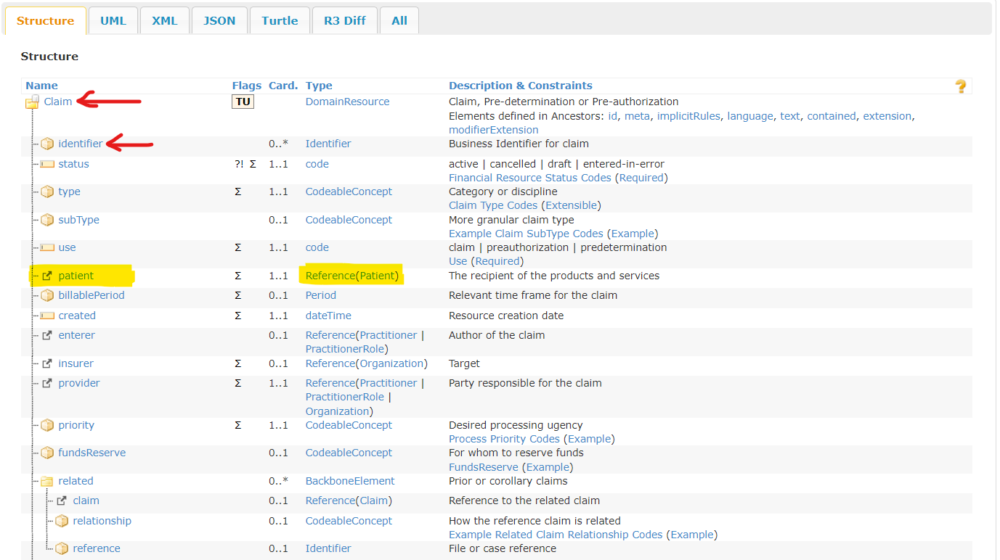

# Configuring the anonymizer file

The `FhirIngestion.Tools` is dependent of the `FhirIngestion.Tools.App`. This last one is used to anonymize the published data. A configuration file is needed and this document will explain how to adjust this configuration file.

## Resources and FHIR format understanding

It is important to understand the FHIR format and how they are built. You will find the important ones on the [HL7 web site](https://www.hl7.org/). For claims ingestion, there are 4 main ones:

* [Claim format](https://www.hl7.org/fhir/claim.html)
* [Patient format](https://www.hl7.org/fhir/patient.html)
* [Organization format](https://www.hl7.org/fhir/organization.html)
* [Practitioner format](https://www.hl7.org/fhir/practitioner.html)

The structure of a claim looks like this:



The points red elements are root and properties. For the anonymizer, it will be represented as `Claim.identifier`. The case is important as well.

The highlighted element of a link on another type of resource. In this case a `Patient`. To access any element from the Patient, you'll then use the same pattern `Patient.something` where something is the element you want to access.

## Creating rules

You will find [/config/anonymizer/anonymizer.json](../../config/anonymizer/anonymizer.json) that can be customized and already integrate some rules. If you need to customize this file, you'll find now detailed explanations.

What you'll find in this file are lines which looks like this:

```json
      {"path": "Claim.identifier", "method": "cryptoHash"},
      {"path": "Claim.status", "method": "keep"},
      {"path": "Claim.type", "method": "keep"},
      {"path": "Claim.use", "method": "keep"},
      {"path": "Claim.created", "method": "dateshift"},
```

From the resources and file format, you'll recognize the names of the fields in the `path`. The `method` is the transformation that will be applied. There are few you can use:

|Method| Applicable to | Description|
| ----- | ----- | ----- |
|keep|All elements| Retains the value as is. |
|redact|All elements| Removes the element. See the parameters section below to handle special cases.|
|dateShift|Elements of type date, dateTime, and instant | Shifts the value using the [Date-shift algorithm](#date-shift).|
|perturb|Elements of numeric and quantity types| [Perturb](#perturb) the value with random noise addition.  |
|cryptoHash|All elements| Transforms the value using [Crypto-hash method](#crypto-hash). |
|encrypt|All elements| Transforms the value using [Encrypt method](#encrypt).  |
|substitute|All elements| [Substitutes](#substitute) the value to a predefined value. |
|generalize|Elements of [primitive](https://www.hl7.org/fhir/datatypes.html#primitive) types|[Generalizes](#generalize) the value into a more general, less distinguishing value.|

All those methods are described below. You will find as well more information in the [project GitHub](https://github.com/microsoft/Tools-for-Health-Data-Anonymization/blob/master/docs/FHIR-anonymization.md#date-shift).

Please refer as well to how you can use path in the [FHIR Path documentation](http://hl7.org/fhirpath/#path-selection).

## Data anonymization algorithms

### Date-shift

You can specify dateShift as a anonymization method in the configuration file. With this method, the input date/dateTime/instant value will be shifted within a 100-day differential. The following algorithm is used to shift the target dates:

#### Input

* [Required] A date/dateTime/instant value
* [Optional] _dateShiftKey_. If not specified, a randomly generated string will be used as default key.
* [Optional] _dateShiftScope_. If not specified, _resource_ will be set as default scope.

#### Output

* A shifted date/datetime/instant value

#### Steps

1. Get _dateShiftKeyPrefix_ according to _dateShiftScope_.
    * For scope _resource_, _dateShiftKeyPrefix_ refers to the resource id.
    * For scope _file_, _dateShiftKeyPrefix_ refers to the file name.
    * For scope _folder_, _dateShiftKeyPrefix_ refers to the root input folder name.
2. Create a string by combining _dateShiftKeyPrefix_ and _dateShiftKey_.
3. Feed the above string to hash function to get an integer between [-50, 50].
4. Use the above integer as the offset to shift the input date/dateTime/instant value.

> * If the input date/dateTime/instant value does not contain an exact day, for example dates with only a year ("yyyy") or only a year and month ("yyyy-MM"), the date cannot be shifted and redaction will be applied.
> * If the input date/dateTime/instant value is indicative of age over 89, it will be redacted (including year) according to HIPAA Safe Harbor Method.
> * If the input dateTime/instant value contains time, time will be redacted. Time zone will keep unchanged.

### Crypto-hash

You can specify the crypto-hash method in the configuration file. We use HMAC-SHA256 algorithm, which outputs a Hex encoded representation of the hashed output (for example, ```a3c024f01cccb3b63457d848b0d2f89c1f744a3d```). If you want the anonymized output to be conformant to the FHIR specification, use Crypto-hash on only those fields that can take a Hex encoded string of 64 bytes length.

A typical scenario is to replace resource ids across FHIR resources via crypto hashing. With a specific hash key, same resource ids that reside in resources and references will be hashed to a same value. There is a special case when crypto hashing a [literal reference](https://www.hl7.org/fhir/references.html#literal) element. The tool captures and transforms only the id part from a reference, for example, reference ```Patient/123``` will be hashed to ```Patient/a3c024f01cccb3b63457d848b0d2f89c1f744a3d```. In this way, you can easily resolve references across anonymized FHIR resources.

### Encrypt

We use AES-CBC algorithm to transform FHIR data with an encryption key, and then replace the original value with a Base64 encoded representation of the encrypted value.

1. The encryption key needs to be exactly 128, 192 or 256 bits long.
2. The algorithm will generate a random and unique initialization vector (IV) for each encryption, therefore the encrypted results are different for the same input values.
3. If you want the anonymized output to be conformant to the FHIR specification, do use encrypt method on those fields that accept a Base64 encoded value. Besides, avoid encrypting data fields with length limits because the Base64 encoded value will be longer than the original value.

### Substitute

You can specify a fixed, valid value to replace a target FHIR field. For example, for postal code, you can provide "12233". For birth date, you can provide '1990-01-01', etc.

For complex data types, you can provide a fixed JSON fragment following the [sample rules](#Sample-rules-using-FHIRPath).
You should provide valid value for the target data type to avoid unexpected errors.

### Perturb

With perturbation rule, you can replace specific values with equally specific, but different values. You can choose to add random noise from a fixed range or a proportional range. In the [age example](#Sample-rules-using-FHIRPath) above, for a fixed range ```[-3, 3]```, every age is within +/- 3 years of the original value. For a proportional range ```[-0.1*originalAge, 0.1*originalAge]```, every age is within +/- 10% years of the original value.

There are a few parameters that can help you customize the noise amount for different FHIR types.

* [required] **span** A non-negative value representing the random noise range. For *fixed* range type, the noise will be sampled from a uniform distribution over ```[-span/2, span/2]```. For *proportional* range type, the noise will be sampled from a uniform distribution over ```[-span/2 * value, span/2 * value]```.
* [optional] **rangeType** Define whether the *span* value is *fixed* or *proportional*. The default value is *fixed*.
* [optional] **roundTo** A value from 0 to 28 that specifies the number of decimal places to round to. The default value is *0* for integer types and *2* for decimal types.

> **NOTE:** The target field should be of either a numeric type (integer, decimal, unsignedInt, positiveInt) or a quantity type (Quantity, SimpleQuantity, Money, etc.).

### Generalize

As one of the anonymization methods, generalization means mapping values to the higher level of generalization. It is the process of abstracting distinguishing value into a more general, less distinguishing value. Generalization attempts to preserve data utility while also reducing the identifiability of the data.
Generalization uses FHIRPath predicate expression to define a set of cases that specify the condition and target value like [sample rules](#Sample-rules-using-FHIRPath). Follows are some examples of cases.

|Data Type|Cases|Explanation|Input data-> Output data|
|-----|-----|-----|-----|
|numeric|`"$this>=0 and $this<20": "20"`|Data fall in the range [0,20) will be replaced with 20. |18 -> 20|
|numeric|`"true": "($this div 10)*10"`|Approximate data to multiples of 10. |18 -> 10|
|string| `"$this in ('es-AR' \| 'es-ES' \| 'es-UY')": "'es'"`|Data fall in the value set will be mapped to "es".|'es-UY' -> 'es'|
|string| `"$this.startsWith(\'123\')": "$this.subString(0,2)+\'*\*\*\*\' "` |Mask sensitive string code.|'1230005' -> '123****'|
|date, dateTime, time|`"$this >= @2010-1-1": "@2010"`|Data fall in a date/time/dateTime range will be mapped to one date/time/dateTime value.| 2016-03-10 -> 2010|
|date, dateTime, time|`"$this": "$this.toString().replaceMatches('(?<year>[0-9]{4})-(?<month>[0-9]{2})-(?<day>[0-9]{2})', '${year}-${month}')"`|Omit "day" to generalize specific date.|2016-01-01 -> 2016-01|

For each generalization rule, there are several additional settings to specify in configuration files:

* [required] **cases** An object defining key-value pairs to specify case condition and replacement value using FHIRPath predicate expression. _key_ represents case condition and _value_ represents target value.
* [optional] **otherValues** Define the operation for values that do not match any of the cases. The value could be "redact" or "keep". The default value is "redact".

Since the output of FHIR expression is flexible, users should provide expressions with valid output value to avoid unexcepted errors.

> **IMPORTANT:** When using regular expressions, you'll have to be careful not using \b \D and other special elements. The parser seems not tolike them. Prefer like in the example range of values and also escape the special characters. For formats like Date, you'll have first to transform them as string with the `toString()` function before being able to use `replaceMatches` or any other function.

For advance usage, please refer to the [FHIR Path](http://hl7.org/fhirpath/) page containing all the possible functions to use.
