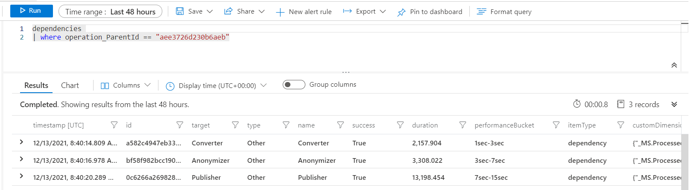
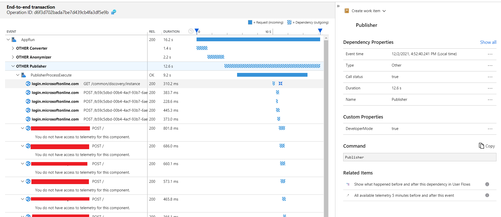
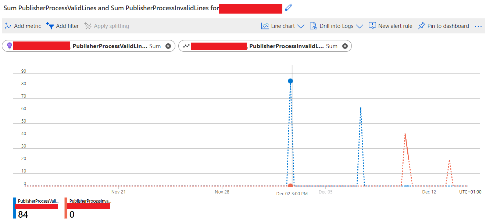

# Telemetry

## Introduction

When the Claims Data Ingestion tool is executed, it can produce telemetry data which can be used to understand how the tool is performing. The telemetry data is gathered centrally, in Azure Application Insights. This document will describe which configuration options are available to enable telemetry, and how to interpret the telemetry data.

> **IMPORTANT:** As mentioned above, the telemetry data is sent to Azure Application Insights, which is a service of the Azure cloud. This means that even when the Claims Data Ingestion tool is executed on premises, the tool can send telemetry data to the cloud. **The Claims Data Ingestion tool's telemetry data does not include any sensitive or PII data.** Also any other data data's published to the FHIR server in the cloud is [properly anonymized](../technical/anonymizer-config-file).
>
> When the Claims Data Ingestion tool's code is updated or extended, avoid adding sensitive or PII data to the telemetry data.

## Configuration

The Claims Data Ingestion tool can be configured by providing a configuration file. The configuration file is a JSON file that contains plenty of options which are all described in the [Getting Started Guide](../getting-started/README.md). Related to telemetry there are two configuration settings that can be configured:

- The Application Insight key `applicationInsightsInstrumentationKey` is not mandatory, if added, it will be used otherwise it will be ignored. You can as well setup an environment variable `APP_INSIGHT_KEY` to setup this value.

## Types of telemetry

The Claims Data Ingestion tool generates multiple types of telemetry. These different types have to be considered as a unit to completely understand how the tool is executing. This section describes these types and their use cases.

### Requests

The highest level of telemetry type is the `AppRun` request. This request event is generated every time the Claims Data Ingestion tool is executed. The important property of this event is `duration`, representing the total execution time of the tool. By tracking this property value over time, it will be possible to detect for example a trend where the execution time is increasing so the appropriate action can be taken.

In the sample above you can see that the total execution time was around 19 seconds. Notice that Application Insights automatically puts that time into a corresponding `performanceBucket` which makes it easy to see how the execution time is distributed.

### Custom events

Custom events are used to track individual executions of the Claims Data Ingestion tool. Currently there is just one custom event implemented which is called `AppRunConfiguration`. In this telemetry event, you can find the configuration settings which were applicable when the tool was executed (in the `config` custom dimension). Notice that secrets like ClientID and ClientSecret are not included in the telemetry data.

### Dependencies

As described above the `Request` event is the highest level of telemetry type. To reflect the different stages of the tool execution, there are multiple so called `Dependency` events. These events are generated when the tool is executed and the different stages of the tool are executed. You can find the dependencies of a request by filtering on the `operation_ParentId` property, which should be equal to the `Request` event's `id` property.

Monitoring the dependencies can be useful to understand the execution time of the stages of the tool.

Sample query:

```text
dependencies 
| where operation_ParentId == "aee3726d230b6aeb"
```



Notice that in the sample query above, the `operation_ParentId` value is equal to the `id` property of the `Requests` sample event.

Also notice in the results that there are 3 dependencies, corresponding to the 3 stages of the tool.

- Converter
- Anonymizer
- Publisher

Each dependency has a `duration` property which represents the execution time of the stage. Application Insights provides another interesting way to visualize these dependencies and their durations in the `Performance` section.



### Custom metrics

The telemetry described so far gives insights in the number of executions (or runs) of the Claims Data Ingestion tool, and the duration of these executions and their dependencies. Besides those, there is also telemetry data to give insights in the amount of data that's being processed every run. This telemetry events are called `customMetrics`.

Each metric has the `valueSum` property which represents the number of corresponding items that were processed, for example the number of successfully published lines. Currently there are the following metrics implemented:

1. Converter stage:
    - Data format services, applicable to all available data format, for example `CSVService`:
        - `CSVServiceImportFiles`: number of files imported
        - `CSVServiceImportLines-[filename]`: number of lines imported, per file
        - `CSVServiceExportLines`: number of lines exported
    - `ConverterProcessTemplatesSucceeded`: Number of successfully processed templates.
    - `ConverterProcessTemplatesFailes`: Number of failed templates.
2. Publisher stage:
    - `PublisherProcessValidLines`: Number of valid lines, published to the FHIR server.
    - `PublisherProcessInvalidLines`: Number of invalid lines, not published to the FHIR server.
    - `PublisherProcessResourceFiles`: Number of resource files.

All metrics are numeric values, which means it's easy to plot them in various charts, or create notifications when their values are above or below a certain threshold. In the  chart below, we have for example the `PublisherProcessValidLines` plotted in blue and `PublisherProcessInvalidLines` plotted in red, over a period of a month. You can clearly see that initially there were claims successfully published, but then the number of invalid claims started to increase.



### Exceptions

The final type of telemetry is the `Exception` event. This event is generated when an exception is thrown during the execution of the Claims Data Ingestion tool.

Sample query:

```text
exceptions 
| order by timestamp desc 
```

## Visualizing telemetry data

Application Insights contains many tools to visualize telemetry data. You can find all options available in the [Application Insights documentation](https://docs.microsoft.com/en-us/azure/application-insights/app/custom-insights-dashboard).
